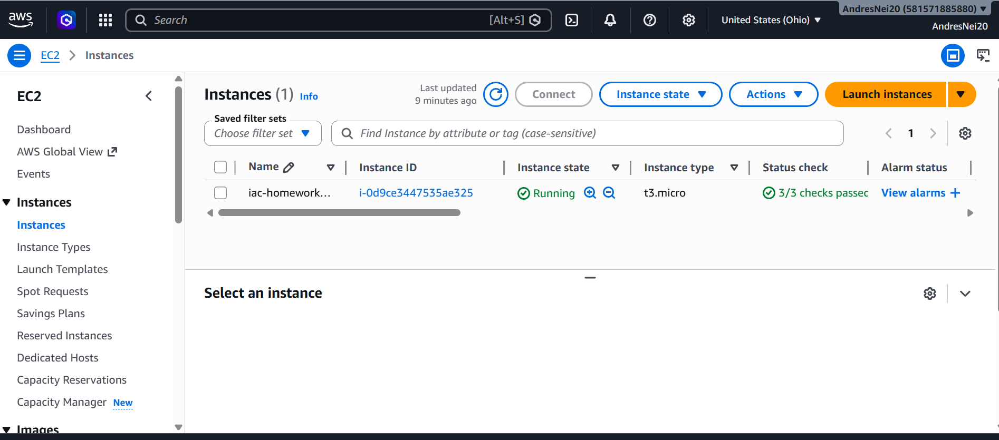

# Infrastructure as Code (IaC) - Terraform Homework

## 📌 Overview

This project demonstrates the use of **Infrastructure as Code (IaC)** using **Terraform Cloud** to deploy a complete infrastructure on AWS.

The solution provisions a virtual machine that hosts a web server displaying a custom HTML page:

> "Hi, I am Andres and this is my IaC"

---

## 🧠 Objectives

- Use Terraform Cloud for remote infrastructure management
- Deploy a virtual machine (EC2) with a web server
- Expose the service to the internet
- Implement network resources using IaC
- Apply modular design
- Use dynamic variables and tags
- Ensure idempotent infrastructure

---

## 🏗️ Architecture

The infrastructure includes:

- **VPC (Virtual Private Cloud)**
- **Public Subnet**
- **Internet Gateway**
- **Route Table & Association**
- **Security Group (HTTP access)**
- **EC2 Instance (t3.micro)**
- **nginx Web Server**

---

## 📁 Project Structure
iac-terraform/
├── main.tf
├── provider.tf
├── variables.tf
├── outputs.tf
│
└── modules/
├── network/
│ ├── main.tf
│ ├── variables.tf
│ └── outputs.tf
│
└── compute/
├── main.tf
├── variables.tf
└── outputs.tf

---

## 🔧 Modules

### Network Module
Creates:
- VPC
- Public subnet
- Internet Gateway
- Route Table
- Route Table Association

### Compute Module
Creates:
- Security Group (allows HTTP traffic)
- EC2 instance
- nginx installation using `user_data`

---

## ⚙️ Variables

Key variables used:

- `project_name`
- `owner_name`
- `region`
- `instance_type`
- `vpc_cidr`
- `public_subnet_cidr`
- `availability_zone`
- `allowed_http_cidr`

---

## 🏷️ Tags

Dynamic tags are applied to all resources:

- Project
- Environment
- Owner
- ManagedBy

---

## 🚀 Deployment

Terraform Cloud is used with a **Version Control Workflow**:

1. Code pushed to GitHub
2. Terraform Cloud detects changes
3. Plan is generated
4. Apply creates infrastructure

---

## 🌐 Output

After deployment:

- Public IP of the EC2 instance
- Website URL

Example:
http://<public-ip>

---

## 🧪 Idempotency

The infrastructure is idempotent.

Running Terraform multiple times results in:
No changes. Your infrastructure matches the configuration.

---

## 📸 Evidence

### AWS EC2 Instance

---

## 🔐 Terraform Cloud Access

Access to the Terraform Cloud workspace has been shared for review.

---

## 📎 Repository

GitHub repository:
https://github.com/AndresNei20/IaC-Terraform

